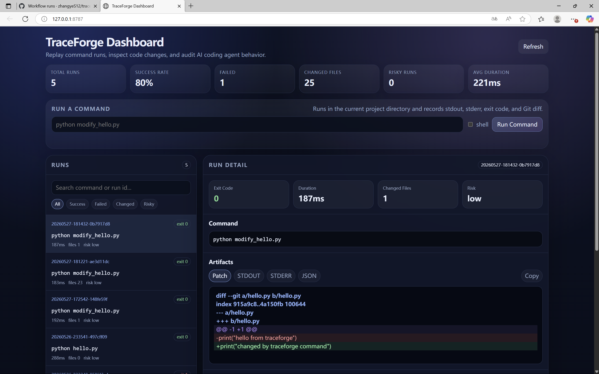

# TraceForge

> **A local black-box recorder for command runs and AI coding agents.**

TraceForge records what actually happened during a coding-agent or shell-command run: stdout, stderr, exit code, duration, Git diff, changed files, timeline events, reports, and JSON traces. It also ships with a local browser dashboard so you can replay and inspect a run without uploading your code anywhere.

<p align="left">
  
  
  
  
</p>

---

## Why TraceForge?

AI coding agents are powerful, but they are often hard to audit:

- What command did the agent run?
- What exactly changed in the repository?
- Which output or error caused the run to fail?
- Did a risky command or sensitive file pattern appear?
- Can the run be exported and attached to an issue or code review?
- Can we reproduce and compare agent behavior later?

TraceForge gives every run a local, reviewable trace.

## What it looks like

The current dashboard is a local web UI started from your project directory:

```bash
traceforge dashboard
```

It shows run metrics, a searchable run list, command details, stdout, stderr, patch diff, changed files, timeline events, and full JSON.



## Core features

- **CLI recorder**: `traceforge run -- <command>` records one command run.
- **Dashboard runner**: run commands directly from the browser dashboard.
- **Replayable timeline**: records command start, stdout/stderr chunks, process exit, Git diff capture, file changes, report generation, and JSON export events.
- **Live output**: `--live` streams stdout/stderr while still recording artifacts.
- **Git diff capture**: records changed files, diff stat, and patch.
- **Local SQLite store**: traces live under `.traceforge/` inside your project.
- **HTML reports**: self-contained report pages for each run.
- **JSON export**: `traceforge export <run_id>` creates machine-readable traces.
- **Doctor checks**: `traceforge doctor` checks Python, Git, Node, Rust, workspace, and database.
- **Selftest**: `traceforge selftest` creates a temporary Git repo and verifies the full record → diff → report → JSON flow.
- **Release checks**: `traceforge release-check` validates local source trees and release zip layout.
- **Security warnings**: configurable warnings for risky command substrings and sensitive file patterns.

## Quick start

Install from the repository root:

```bash
python -m pip install -e .
```

Initialize TraceForge in a Git project:

```bash
traceforge init
traceforge doctor
```

Create a small script:

```bash
python -c "open('hello.py', 'w').write('print(\"hello from traceforge\")\\n')"
```

Record a command:

```bash
traceforge run --live -- python hello.py
```

Open the dashboard:

```bash
traceforge dashboard
```

On Windows PowerShell, you can create the script like this:

```powershell
Set-Content hello.py 'print("hello from traceforge")'
traceforge run --live -- python hello.py
traceforge dashboard
```

## Browser workflow

Start the local dashboard:

```bash
traceforge dashboard
```

Then type a command directly in the browser, for example:

```bash
python modify_hello.py
```

TraceForge will run it locally, record stdout/stderr, capture Git diff, refresh the run list, and open the new run detail automatically.

The dashboard runs on localhost only by default:

```text
http://127.0.0.1:8787
```

## CLI reference

```bash
traceforge init
traceforge doctor [--json]
traceforge run [--live] [--shell] [--no-propagate-exit] -- <command>
traceforge list [--limit 20]
traceforge show <run_id>
traceforge timeline <run_id> [--json]
traceforge report <run_id>
traceforge open [run_id]
traceforge dashboard [--host 127.0.0.1] [--port 8787] [--no-open]
traceforge diff <run_a> <run_b>
traceforge export <run_id> [--out trace.json]
traceforge clean [--yes] [--all]
traceforge selftest [--json]
traceforge release-check [--zip path] [--json]
traceforge demo [path]
traceforge version
```

## Shellless vs shell mode

By default, TraceForge runs commands without a shell:

```bash
traceforge run -- python hello.py
```

This is safer and avoids many Windows quoting issues.

Use shell mode only when you need shell syntax such as `&&`, pipes, or redirects:

```bash
traceforge run --shell -- "npm test && npm run lint"
```

In the dashboard, enable the `shell` checkbox for the same behavior.

## Local data layout

TraceForge writes local data to `.traceforge/`:

```text
.traceforge/
  config.json
  traceforge.db
  runs/
    <run_id>/
      stdout.txt
      stderr.txt
      patch.diff
      trace.json
  reports/
    index.html
    latest.html
    <run_id>.html
```

`.traceforge/` should stay out of Git. The default `.gitignore` includes it.

## Architecture

```text
CLI / dashboard command
        ↓
security pre-check
        ↓
Git snapshot before
        ↓
subprocess execution
        ↓
stdout/stderr capture
        ↓
Git snapshot after + patch diff
        ↓
SQLite trace storage
        ↓
Timeline events + SQLite trace storage
        ↓
HTML report / JSON export / dashboard API
```

## Public-readiness checks

Before publishing or debugging a user environment:

```bash
traceforge doctor
traceforge selftest
traceforge release-check
```

Before sharing a zip release:

```bash
traceforge release-check --zip traceforge_v0_7_1.zip
```

These checks exist because real user environments are messy: Windows encodings, missing tools, broken PATH entries, stale dashboards, and packaging mistakes can all happen.

## Roadmap

### Near term

- Side-by-side diff viewer.
- Test-result parsers for pytest, npm, Jest, and cargo test.
- Run tags, notes, and search improvements.
- Timeline filtering and event detail drawers.
- Better dashboard empty states and error recovery.
- Installable package release workflow.

### Agent-focused roadmap

- Adapters for Codex, Claude Code, Cline, OpenHands, and custom agent wrappers.
- MCP tool-call recording.
- Prompt-injection and sensitive-file audit layer.
- Docker sandbox execution.
- Network allow/deny policy.
- Run replay and richer run comparison.

### Long-term vision

TraceForge should become the local observability layer for agentic coding: every command, file change, tool call, test failure, and generated patch should be reproducible, inspectable, and safe to share.

## Resume description

> Built TraceForge, a local black-box recorder for AI coding agents and shell commands. Implemented a CLI and browser dashboard that capture subprocess output, Git patches, changed files, fine-grained timeline events, runtime metadata, security warnings, SQLite traces, HTML replay reports, JSON exports, selftests, and release checks.

## Contributing

Good first contributions:

- Add a test-result parser.
- Improve HTML diff rendering.
- Add support for tags and run notes.
- Add Docker sandbox execution.
- Add adapters for common coding agents.

See [CONTRIBUTING.md](CONTRIBUTING.md) for development setup.

## License

MIT.
