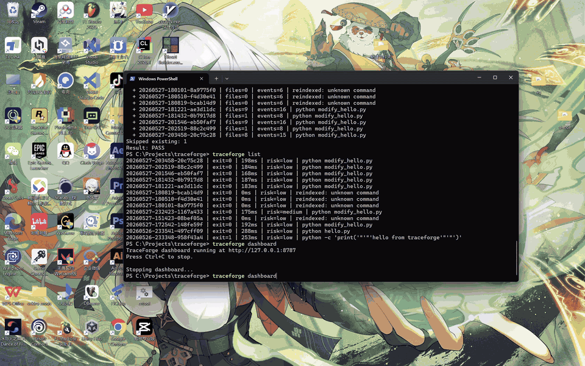

# TraceForge

> **Local black-box recorder and adapter layer for command runs and AI coding agents.**

TraceForge records what actually happened during a coding-agent or shell-command run, and now includes a thin adapter layer for wrapping agent CLIs: stdout, stderr, exit code, duration, Git diff, changed files, timeline events, security findings, run comparisons, HTML reports, and JSON traces. It also ships with a localhost dashboard so you can replay and inspect runs without uploading your code anywhere.

<p align="left">
  
  
  
  
</p>

---

## Why TraceForge?

AI coding agents are powerful, but they are still hard to audit:

- What command did the agent run?
- What exactly changed in the repository?
- Which output or error happened before the patch?
- Did the run touch dependency files, CI workflows, or sensitive-looking files?
- Can two agent attempts be compared side by side?
- Can a run be exported and attached to an issue or code review?

TraceForge gives every run a local, reviewable trace.

## What it looks like

Start the dashboard from a project directory:

```bash
traceforge dashboard
```

It shows run metrics, searchable run history, command details, timeline events, risk report, stdout, stderr, patch diff, changed files, compare view, and full JSON.




## 30-second demo

From the repository root:

```bash
python -m pip install -e .
traceforge demo
cd traceforge-demo-project
traceforge run --live -- python test_calculator.py
traceforge dashboard
```

You should see one recorded run with stdout, exit code, timeline events, changed files, risk findings, and a replayable patch view.

## When to use it

Use TraceForge when:

- you are letting an AI coding agent modify a repository
- you want a local audit trail for command runs
- you need to compare two repair attempts
- you want to export a reproducible run report for review

Do not use TraceForge as:

- a sandbox
- a secret scanner replacement
- a full CI system
- a child-process monitor for every process an agent may spawn

Git shows what changed. Terminal logs show what printed. TraceForge links the command, output, timeline, risk findings, and patch into one replayable local trace.

## Install

Install TraceForge from PyPI:

```bash
python -m pip install traceforge-ai
traceforge version
```

Or clone the repository and install it in editable mode:

```bash
git clone https://github.com/zhangyeS12/traceforge.git
cd traceforge
python -m pip install -e .
traceforge version
```

Requirements:

- Python 3.10+
- Git
- A Git repository for meaningful diff capture

Optional tools checked by `traceforge doctor`:

- Node / npm
- Rust / Cargo

## Quick start

Initialize TraceForge in a Git project:

```bash
traceforge init
traceforge doctor
```

Create a simple script:

```bash
python -c "open('hello.py', 'w').write('print(\"hello from traceforge\")\n')"
```

Record a command:

```bash
traceforge run --live -- python hello.py
```

Open the dashboard:

```bash
traceforge dashboard
```

On Windows PowerShell:

```powershell
Set-Content hello.py 'print("hello from traceforge")'
traceforge run --live -- python hello.py
traceforge dashboard
```

## Browser workflow

Start the local dashboard:

```bash
traceforge dashboard
```

Then type a command directly in the browser, for example:

```bash
python modify_hello.py
```

TraceForge will run it locally, record stdout/stderr, capture Git diff, refresh the run list, and open the new run detail automatically.

The dashboard runs on localhost by default:

```text
http://127.0.0.1:8787
```

## Core features

- **CLI recorder**: `traceforge run -- <command>` records one command run.
- **Dashboard runner**: run commands directly from the browser dashboard.
- **Agent adapters**: wrap `shell`, `codex`, `claude`, `aider`, `opencode`, or custom agent commands with `traceforge agent run`.
- **Replayable timeline**: command start, stdout/stderr chunks, process exit, Git snapshots, diff capture, file changes, report generation, and run completion.
- **Run comparison**: compare two runs by exit code, duration, changed files, event count, patch size, and file overlap.
- **Security risk report**: scan risky commands, sensitive-looking files, dependency/CI changes, broad file changes, traceback output, and possible secret material.
- **Live output**: `--live` streams stdout/stderr while still recording artifacts.
- **Run-attributed Git diff capture**: records files changed by the current run, filters out pre-existing unchanged dirty files, and includes untracked new file contents in the patch.
- **Local SQLite store**: traces live under `.traceforge/` inside your project.
- **HTML reports**: self-contained report pages for each run.
- **JSON export**: `traceforge export <run_id>` creates machine-readable traces; `--redact` masks common secrets and local user paths before sharing.
- **Doctor checks**: `traceforge doctor` checks Python, Git, optional toolchains, workspace, and database.
- **Selftest**: `traceforge selftest` creates a temporary Git repo and verifies the full record → diff → report → JSON → compare → risk flow.
- **Version guard**: `traceforge version-check` validates version metadata; `traceforge reindex` rebuilds the local run index from existing run artifacts.
- **Release checks**: `traceforge release-check` validates local source trees and release zip layout.

## CLI reference

```bash
traceforge init
traceforge doctor [--json]
traceforge run [--live] [--shell] [--no-propagate-exit] -- <command>
traceforge list [--limit 20]
traceforge show <run_id>
traceforge timeline <run_id> [--json]
traceforge compare <run_a> <run_b> [--json]
traceforge risk <run_id> [--json]
traceforge agent list
traceforge agent doctor
traceforge agent run <adapter> [--live] [--preview] -- <task-or-command>
traceforge report <run_id>
traceforge open [run_id]
traceforge dashboard [--host 127.0.0.1] [--port 8787] [--no-open]
traceforge diff <run_a> <run_b>  # alias for compare
traceforge export <run_id> [--out trace.json] [--redact]
traceforge clean [--yes] [--all]
traceforge selftest [--json]
traceforge version-check
traceforge reindex [--json]
traceforge release-check [--zip path] [--json]
traceforge demo [path]
traceforge version
```

## Shellless vs shell mode

By default, TraceForge runs commands without a shell:

```bash
traceforge run -- python hello.py
```

This is safer and avoids many Windows quoting issues.

Use shell mode only when you need shell syntax such as `&&`, pipes, or redirects:

```bash
traceforge run --shell -- "npm test && npm run lint"
```

In the dashboard, enable the `shell` checkbox for the same behavior.

## Agent adapters

List available adapters:

```bash
traceforge agent list
traceforge agent doctor
```

Run a passthrough command through the adapter layer:

```bash
traceforge agent run shell -- python modify_hello.py
```

Preview an agent command without running it:

```bash
traceforge agent run codex --preview -- "fix the failing tests"
```

TraceForge keeps adapters thin: the adapter builds the local command, and the core recorder still captures stdout, stderr, Git diff, timeline, compare, and risk report.

See [docs/agent-recipes.md](docs/agent-recipes.md) for Codex, Claude Code, Aider, opencode, shell, and custom adapter examples.

## Run comparison

Compare two attempts:

```bash
traceforge compare <run_a> <run_b>
```

TraceForge compares:

- exit code
- duration
- event count
- changed file count
- patch size
- common files
- files only changed in one run
- status changes by file

## Risk report

Generate a security-oriented run report:

```bash
traceforge risk <run_id>
```

The risk report looks for:

- risky command substrings
- sensitive-looking file paths
- dependency or package-management file changes
- CI workflow changes
- broad file changes
- possible secret material in patches
- traceback output in stderr

## Sharing traces safely

TraceForge is local-first, but exported traces can still contain private source, terminal output, local usernames, tokens, or API keys. Use redacted export before attaching a trace to an issue or review:

```bash
traceforge export <run_id> --redact --out trace.redacted.json
```

Redaction is a best-effort sharing aid, not a guarantee. Review exported files before posting them publicly.

## Local data layout

TraceForge writes local data to `.traceforge/`:

```text
.traceforge/
  config.json
  traceforge.db
  runs/
    <run_id>/
      stdout.txt
      stderr.txt
      patch.diff
      trace.json
  reports/
    index.html
    latest.html
    <run_id>.html
```

`.traceforge/` should stay out of Git. The default `.gitignore` includes it.

## Architecture

```text
CLI / dashboard command
        ↓
security pre-check
        ↓
Git snapshot before
        ↓
subprocess execution
        ↓
stdout/stderr capture
        ↓
Git snapshot after + patch diff
        ↓
SQLite trace storage
        ↓
timeline events + risk assessment
        ↓
HTML report / JSON export / dashboard API
```

## Public-readiness checks

Before publishing or debugging a user environment:

```bash
traceforge doctor
traceforge version-check
traceforge reindex
traceforge selftest
traceforge release-check
```

Before sharing a zip release:

```bash
traceforge release-check --zip traceforge_v1_3_1.zip
```

## Roadmap

### Near term

- Side-by-side diff viewer.
- Richer compare views for timeline differences and artifact differences.
- Configurable security rules and risk thresholds.
- Test-result parsers for pytest, npm, Jest, and cargo test.
- Run tags, notes, and search improvements.
- Timeline filtering and event detail drawers.
- Better dashboard empty states and error recovery.
- Installable package release workflow.

### Agent-focused roadmap

- More robust adapters for Codex, Claude Code, Cline, OpenHands, and custom agent wrappers.
- MCP tool-call recording.
- Prompt-injection and sensitive-file audit layer.
- Docker sandbox execution.
- Network allow/deny policy.
- Run replay, agent adapters, and benchmark-style comparison reports.

### Long-term vision

TraceForge should become the local observability layer for agentic coding: every command, file change, tool call, test failure, and generated patch should be reproducible, inspectable, and safe to share.

## Resume description

> Built TraceForge, a local black-box recorder for AI coding agents and shell commands. Implemented a CLI and browser dashboard that capture subprocess output, Git patches, changed files, fine-grained timeline events, run comparison, runtime metadata, security findings, SQLite traces, HTML replay reports, JSON exports, selftests, release checks, and GitHub CI.

## Contributing

Good first contributions:

- Add a test-result parser.
- Improve HTML diff rendering.
- Add support for tags and run notes.
- Add Docker sandbox execution.
- Add adapters for common coding agents.

See [CONTRIBUTING.md](CONTRIBUTING.md) for development setup.

## Security

See [SECURITY.md](SECURITY.md) for supported versions, reporting guidance, and current security limitations.

## License

MIT.
